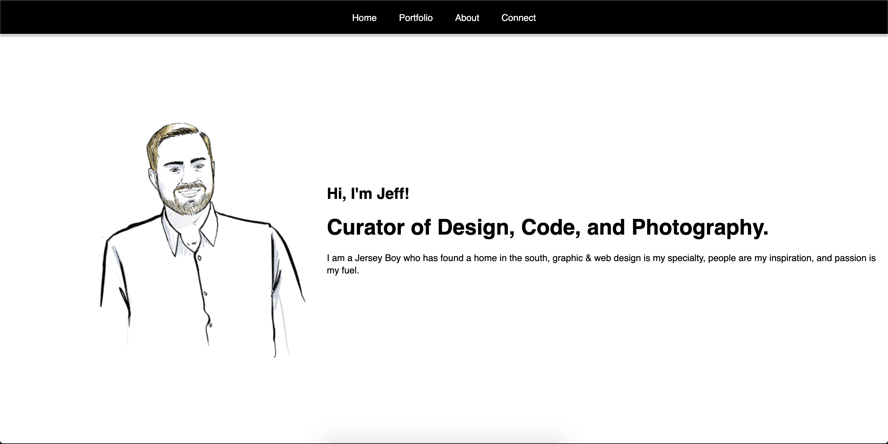

# Unit-02-Advanced-CSS-Portfolio
This is the next evolution in my portfolio website, it incorporates advance CSS styles, responsive design, and online forms. This project is a stepping stone and will evolve as each week unfolds new skills to add to my toolshed. This site is consider _WIP_ as the evolution process never ends.

## GitHub Links 
Live Page [Link](https://jeffcela.github.io/02-Advanced-CSS-Portfolio/)  
Project Repository [Link](https://github.com/jeffcela/02-Advanced-CSS-Portfolio)

## How its made!
Make sure to clone or download the entire repository as this document uses **HTML, CSS, and JPG/PNGs.** Adding additional comments with the HTML or CSS code will allow for the continue ease of use when updating for future use. There are additional images that can be used in future versions of the work that J.Cela has made. The _Current Project_ should be updated as new projects become public.

**What is included:**
* index.html
* assets folder
   * css folder
      * style.css
   * images folder

*Please make sure that you are adding any additional assets as needed*

## If you see this you are on the landing page!
   

# Credit 
_This homework assignment was completed in VS Code and Terminal by [Jeff Cela](https://www.linkedin.com/in/jeffcela/) on the day of 07/06/2021_ 
© 2021 Trilogy Education Services, LLC, a 2U, Inc. brand. Confidential and Proprietary. All Rights Reserved. 
_HTML._ W3Schools Online Web Tutorials. (1999). [https://www.w3schools.com/](https://www.w3schools.com/). 
